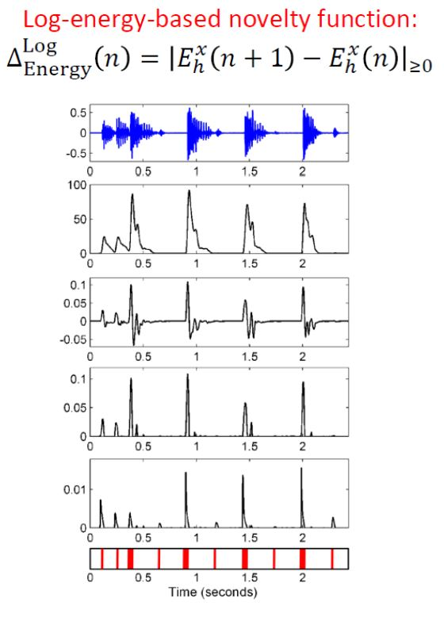
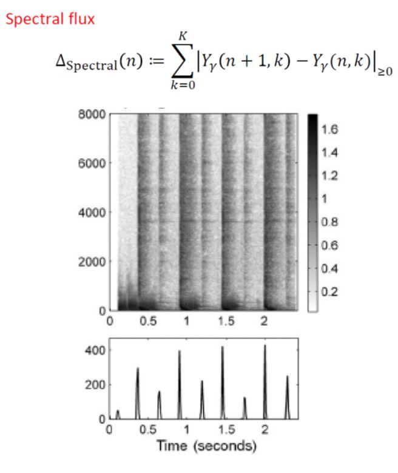

# 1.OnsetDetection-python
python implementation of onset detection.

 

* Apply the energy based novelty or spectral based novelty analysis to detecting onset events.

* Implement the energy based and spectral based novelty analysis to find the onset positions and create a wave file with beats (high magnitude) at these onset locations (zero magnitude everywhere else).

# 2.Chord Generation using Markov chian
This is based on ten Korean Agitation.

# 3.Rythm & Melody Generation using Motive
Use random
